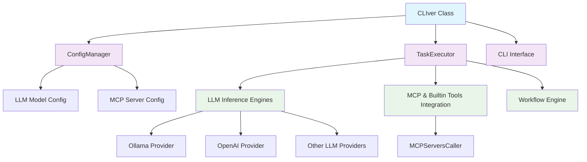

# CLIver Overview

CLIver is an AI-powered command-line interface tool that enhances your terminal experience with intelligent capabilities.
It integrates with MCP (Model Context Protocol) servers and various LLM providers to provide an interactive CLI experience.

## Design Goals

CLIver is built with dual-purpose functionality in mind:

- **CLI Usability**: Provides intuitive command-line tools for direct interaction with LLMs
- **Library Flexibility**: Offers Python library interfaces for programmatic integration
- **Extensibility**: Designed with modular architecture to support custom commands and backends
- **Security**: Planned integration for secure secret management

## Key Features

### Core Capabilities
- **Multi-LLM Support**: Connect to various language models served by various providers(DeepSeek, OpenAI, Qwen3-coder on OpenAI compatible servers, vLLM, and more in the future)
- **MCP Integration**: Seamlessly integrate with Model Context Protocol servers for enhanced functionality
- **Secure Operations**: Planned secrets management system for secure handling of API keys and credentials
- **Configurable Workflows**: Define and execute complex workflows using YAML configuration files
- **Extensible Architecture**: Easy to extend with custom commands and backends

### Usage Modes
CLIver operates in two primary modes:

1. **Interactive and Batch CLI Mode**: Direct command-line interaction for immediate responses and operations
2. **Library Mode**: Python library integration for embedding LLM capabilities in your applications

## Architecture

CLIver follows a modular architecture that allows for easy extension:

<figure markdown>

</figure>

## Getting Started

To start using CLIver, visit our [Installation Guide](installation.md) to set up the tool on your system, followed by the [Configuration Guide](configuration.md) to connect to your preferred LLM provider.