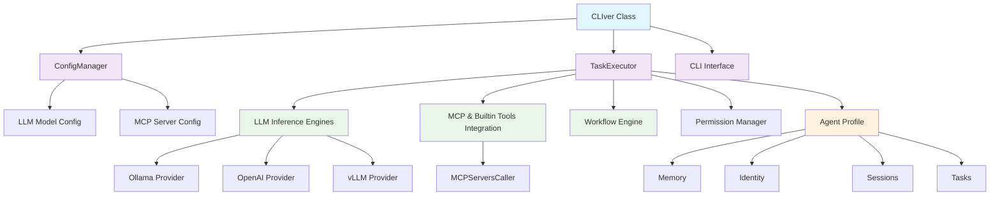

# CLIver Overview

CLIver is a **general-purpose AI agent** — it is not bound to coding or any specific domain. Through customizable system prompts, skills, workflows, and MCP integrations, CLIver adapts to whatever task you throw at it.

## Philosophy

**General-purpose by design.** Most AI agents are built for a specific field (coding, customer support, data analysis). CLIver takes a different approach — it provides a flexible foundation that you specialize through configuration: skills teach it new domains, workflows orchestrate multi-step processes, and MCP servers connect it to external systems.

**Safe and controlled by default.** Autonomous agents are powerful but can behave unpredictably. CLIver addresses this with a layered permission system that governs every tool execution and a structured workflow engine that keeps complex tasks focused and auditable. You decide what the agent can do, and it stays within those boundaries.

## Design Goals

CLIver is built as a **dual-layer system**:

- **API Layer** (`TaskExecutor`): The core engine — embeddable in any Python application. It handles LLM inference, tool calling, Re-Act loops, permissions, and workflow execution with no dependency on CLI concerns (no terminal, no stdin, no prompt_toolkit). This is the layer you use when integrating CLIver as a library.
- **CLI Layer** (`Cliver` class + Click commands): A thin interactive shell on top of `TaskExecutor` for terminal users. Provides Rich-formatted output, prompt_toolkit input, and slash commands.

Any feature built at the API layer (permissions, workflows, skills, memory) works identically whether invoked from the CLI or from your own Python code.

## Key Features

### Core Capabilities
- **Multi-LLM Support**: Connect to various language models served by various providers (DeepSeek, OpenAI, Qwen3-coder on OpenAI compatible servers, vLLM, and more in the future)
- **MCP Integration**: Seamlessly integrate with Model Context Protocol servers for enhanced functionality
- **Builtin Tools**: 17 tools (12 core, 5 contextual) for file I/O, shell, web, planning, memory, identity, and skills
- **Tool Permissions**: Resource-aware [permission system](permissions.md) controlling which tools can execute and what resources they can access
- **Skills**: LLM-driven [skill activation](skills.md) from SKILL.md files for specialized tasks
- **Memory & Identity**: [Agent memory and identity profiles](memory-identity.md) with multi-agent isolation
- **Session Management**: [Conversation history](session-management.md) with LLM-based compression and session persistence
- **Configurable Workflows**: Define and execute complex workflows using YAML configuration files
- **Task Scheduling**: Schedule workflows with cron expressions
- **Token Usage**: Track and view token usage statistics per model and session
- **Extensible Architecture**: Easy to extend with custom commands and backends

### Usage Modes
CLIver operates in two primary modes:

1. **Interactive and Batch CLI Mode**: Direct command-line interaction for immediate responses and operations
2. **Library Mode**: Python library integration for embedding LLM capabilities in your applications

## Architecture

CLIver follows a modular architecture that allows for easy extension:

<figure markdown>

```mermaid
graph TD
    A[CLIver Class] --> B[ConfigManager]
    A --> C[TaskExecutor]
    A --> D[CLI Interface]

    B --> E[LLM Model Config]
    B --> F[MCP Server Config]

    C --> G[LLM Inference Engines]
    C --> H[MCP & Builtin Tools Integration]
    C --> I[Workflow Engine]
    C --> N[Permission Manager]
    C --> O[Agent Profile]

    G --> J[Ollama Provider]
    G --> K[OpenAI Provider]
    G --> L[vLLM Provider]

    H --> M[MCPServersCaller]

    O --> P[Memory]
    O --> Q[Identity]
    O --> R[Sessions]
    O --> S[Tasks]

    style A fill:#e1f5fe
    style B fill:#f3e5f5
    style C fill:#f3e5f5
    style D fill:#f3e5f5
    style G fill:#e8f5e8
    style H fill:#e8f5e8
    style I fill:#e8f5e8
    style O fill:#fff3e0
```

</figure>

## Getting Started

To start using CLIver, visit our [Installation Guide](installation.md) to set up the tool on your system, followed by the [Configuration Guide](configuration.md) to connect to your preferred LLM provider.
