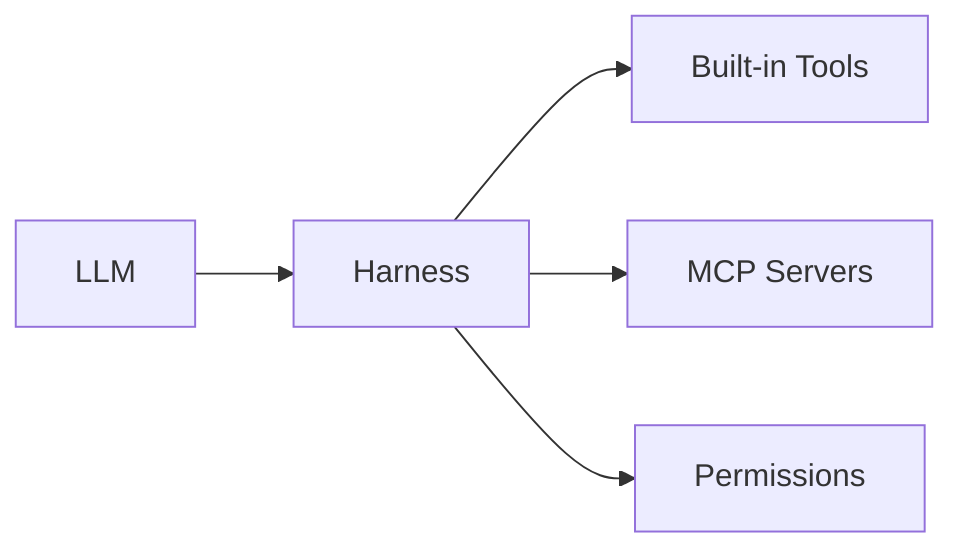

Tools are what let the agent **do things** — read files, run commands, search the web, manage todos. CLIver ships with a set of built-in tools, and can connect to external tools via MCP servers.

## The Harness

The harness is CLIver's orchestration layer — it coordinates the Re-Act loop, built-in tools, MCP servers, skills, and the permission system. When the LLM decides to use a tool, the harness routes the call through permission checks, executes it (locally or via MCP), and feeds the result back.

## How Tools Work

Each tool is a Python function with a Pydantic schema. The LLM sees tool names and descriptions in its system prompt. When it decides to use one, the harness executes the function and feeds the result back into the conversation.

## Built-in Tool Categories

| Category | Tools |
|----------|-------|
| **File I/O** | `read_file`, `write_file`, `list_directory`, `grep_search` |
| **Shell** | `run_shell_command`, `docker_run`, `execute_code` |
| **Web** | `web_search`, `web_fetch`, `browse_web`, `browser_action` |
| **Task Management** | `todo_read`, `todo_write`, `create_task` |
| **Knowledge** | `identity_update`, `memory_read`, `memory_write`, `search_sessions` |
| **Interaction** | `ask_user_question`, `cliver_help`, `skill` |
| **Media** | `image_generate` |

## MCP Servers

Beyond built-in tools, CLIver can connect to any [Model Context Protocol](https://modelcontextprotocol.io) server for extended capabilities — file systems, databases, APIs, and more — all through a standardized protocol. The harness treats MCP tools the same as built-in ones: same permission checks, same execution flow.

## Tool Discovery

Built-in tools are auto-discovered from `src/cliver/tools/`. MCP servers are configured in `config.yaml`. You can filter available tools via `enabled_toolsets` in config.

